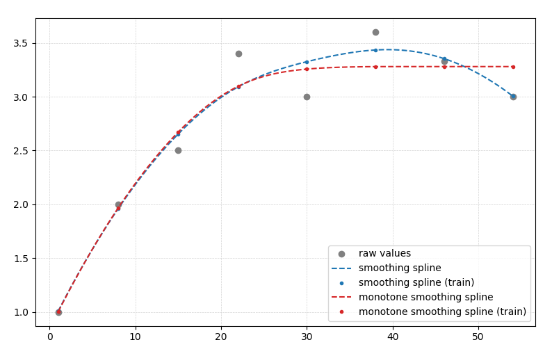

# Penalized B-Splines

Offers (monotonically increasing) smoothing splines implementation using penalized B-splines (aka. P-splines).

Solves the equation

    (B'B + λD3'D3 + κD1'VD1)α = B'y

where

    B'B: The least squares part
    λD3'D3: The smoothing part
    κD1'VD1: The monotonicity part
    α: The coefficients of the B-spline basis functions

The algorithm was introduced in [^Eilers2005], and explained for example in
[^Hofner2011] and [^Hofner2014unified]. It is iterative at nature and gives *approximately*
monotone spline function as output which are "monotone enough" for most of the practical
applications. The monotonicity is enforced by a large penalty term κ. If you require
strictly monotone function, you should check I-splines. Since this uses "regular"
P-splines, you might use any other added penalty terms to enforce other properties, like
cyclicity. The monotonicity part can be swapped to enforce convex/concave shapes
(U-shape or inverse U-shape).

# Examples

Usage example:

- Use the `create_pspline()` function to create a scipy [BSpline](https://docs.scipy.org/doc/scipy/reference/generated/scipy.interpolate.BSpline.html) instance.
- Then use the created B-spline to calculate values on a set of points

```python
import numpy as np
from matplotlib import pyplot as plt

from penalized_splines import create_pspline

y = np.array([1.0, 2.0, 2.5, 3.4, 3.0, 3.6, 3.33, 3.0])
x = np.array([1, 8, 15, 22, 30, 38, 46, 54])
x_valid = np.linspace(min(x), max(x), 1000)

knot_segments = 100

monotone_spline = create_pspline(
    x, y, lambda_smoothing=100000.0, knot_segments=knot_segments, kappa_penalty=10e6
)

plt.plot(x, y, label="raw values", marker="o", ls="", color="gray")
plt.plot(x_valid, monotone_spline(x_valid), label="spline", ls="--", color="tab:red")
plt.plot(
    x, monotone_spline(x), label="spline (train)", marker=".", ls="", color="tab:red"
)

plt.legend()
plt.grid(ls="--", lw=0.5, color="lightgray")
plt.show()
```

- `lambda_smoothing`: controls amount of smoothing. `lambda_smoothing=0` turns smoothing off. Larger values smooth more.
- `kappa_penalty`: Controls the monotonicity. Use a large value (`>1e6`) here. `kappa_penalty=0` turns off monotonicity.

## Example 1

Created with

```
uv run example.py
```



##  Example 2

Using data from [this SO question](https://stackoverflow.com/questions/56551114/fully-monotone-interpolation-in-python):


[^Eilers2005]: Eilers, P. H. C. 2005. Unimodal smoothing. Journal of Chemometrics
              19:317–328. DOI:10.1002/cem.935.
[^Hofner2011]: Hofner et al. (2011) Monotonicity-constrained species distribution models.
            Link: https://esajournals.onlinelibrary.wiley.com/doi/pdf/10.1890/10-2276.1
[^Hofner2014unified]: Hofner et al (2014) A Unified Framework of Constrained Regression.
            Link: https://arxiv.org/abs/1403.7118