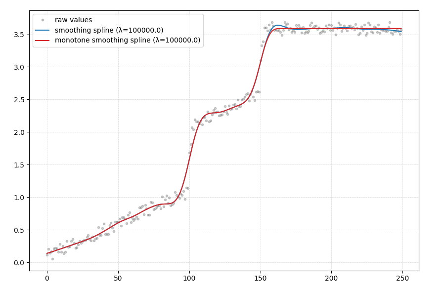

# Penalized B-Splines

Smoothing (monotonically increasing) splines implementation using penalized B-splines (aka. P-splines).

# Examples

Usage example:

- Use the `create_pspline()` function to create a scipy [BSpline](https://docs.scipy.org/doc/scipy/reference/generated/scipy.interpolate.BSpline.html) instance.
- Then use the created B-spline to calculate values on a set of points

```python
import numpy as np
from matplotlib import pyplot as plt

from penalized_splines import create_pspline

y = np.array([1.0, 2.0, 2.5, 3.4, 3.0, 3.6, 3.33, 3.0])
x = np.array([1, 8, 15, 22, 30, 38, 46, 54])
x_valid = np.linspace(min(x), max(x), 1000)

knot_segments = 100

monotone_spline = create_pspline(
    x, y, lambda_smoothing=100000.0, knot_segments=knot_segments, kappa_penalty=10e6
)

plt.plot(x, y, label="raw values", marker="o", ls="", color="gray")
plt.plot(x_valid, monotone_spline(x_valid), label="spline", ls="--", color="tab:red")
plt.plot(
    x, monotone_spline(x), label="spline (train)", marker=".", ls="", color="tab:red"
)

plt.legend()
plt.grid(ls="--", lw=0.5, color="lightgray")
plt.show()
```

- `lambda_smoothing`: controls amount of smoothing. `lambda_smoothing=0` turns smoothing off. Larger values smooth more.
- `kappa_penalty`: Controls the monotonicity. Use a large value (`>1e6`) here. `kappa_penalty=0` turns off monotonicity.

## Example 1

Created with

```
uv run example.py
```


##  Example 2

Using data from [this SO question](https://stackoverflow.com/questions/56551114/fully-monotone-interpolation-in-python):




# Theory

## What this package does?
This package solves the equation describing [P-splines](#p-splines)

    (B'B + λD3'D3 + κD1'VD1)α = B'y

where

    B'B: The least squares part
    λD3'D3: The smoothing penalty part
    κD1'VD1: The monotonicity penalty part
    α: The coefficients of the B-spline basis functions

The algorithm was introduced in [^eilers2005], and explained for example in
[^hofner2011] and [^hofner2014unified]. It is iterative at nature and gives *approximately*
monotone spline function as output which are "monotone enough" for most of the practical
applications. The monotonicity is enforced by a large penalty term κ. 


## P-splines

One very nicely behaving (easy local control of shape, continuity) type of splines is the [B-spline](https://en.wikipedia.org/wiki/B-spline). When people fit the B-spline coefficients using penalties, they call it a [P-spline](https://en.wikipedia.org/wiki/B-spline#P-spline), but it's still essentially just a B-spline; only the matter how the coefficients were calculated is different. With P-splines, part of the coefficients are coming from the data and part from the penalty function. There are different types of penalty functions, which with parameters can be used to control different properties.  Some examples are:

1. [**Smoothing**](#smoothing-term)
2. [**Monotonic**](#monotonicity-term)
3. [**Convex/Concave**](#convex--concave-term)
4. [**Cyclic**](#cyclic-term)

### Smoothing term

A smoothing spline function is a non-interpolating spline. An interpolating spline goes through all the ("training") data points, and smoothing spline function does not. One of the earliest ideas was to penalize the integral of the second derivative of the function to make it smooth. This is pretty intuitive as if a function has a large second derivative it's direction is changing a lot; integral of second derivative of a squiggly function will be large and intergral of second derivative of a smooth function will be small.

Eilers & Marx proposed a bit easier way to calculate the penalty: Instead of calculating integral, calculate sums of order *d* differences of the fitted coefficients[^eilersmarx1996]. That's the discrete approximation of the integrated square of the *d*th derivative and it's considerably easier to calculate. 

The *d* in the smoothing term was fixed to 3 in the Eilers's 2005 paper[^eilers2005]. I'm guessing this is not a strict rule but perhaps a good rule of thumb he has gained from the about 10 years of experience after releasing his 1996 paper. The paper of Bollaerts *et al.* [^bollaerts2006simple] gives a probable reason: When order *d* differences are used with the smoothing term, when `λ → ∞`, the function will approach a polynomial of degree *d-1*. Therefore using difference order of 3 is probably a good first guess in the smoothing part as it would make the function approach a 2nd order polynomial with strong smoothing.

This package implements the smoothing term using 3rd order differences and gives possibility to control the smoothing using a parameter called `lambda_smoothing`.

### Monotonicity term

The monotonicity penalty was introduced in another paper from Paul H.C. Eilers 2015[^eilers2005] which is behind a paywall, but the main equation is cited for example in two[^hofner2011] papers[^hofner2014unified] by Hofner *et al.*. The most commonly cited form of the equation is actually such which makes the fitted model _practically_ monotone; it has (or must have?) very small disruptions to the "forbidden" direction. If an application would necessitate strictly monotonic, one  should try the "delta trick" introduced by Eilers[^eilers2005] and still check the function manually for monotonicity before using it. Another possiblity would be to use I-Splines.

This package implements penalty term for creating monotonically increasing functions. It can be controlled with the `kappa_penalty` parameter, and `kappa_penalty=0` turns it off. A good starting value for `kappa_penalty` is `1e6`.  The "delta trick" mentioned above" is not implemented. 

### Convex / Concave term

**Idea**: Add penalty to make the spline function to form "U-shape" or "upside down U-shape" curve (globally). This would be basically same term than the "monotonic", with few changes. The convex / concave restriction is **not implemented**, but would be possible to add.

### Cyclic term

**Idea**: Add penalty to make the spline function cyclic; start and end are made continous. **Not implemented**, but would be possible to add.

### Optimal parameter values?

The optimal parameters, like the optimal amount of smoothing could be chosen based on Cross-Validation and Akaike information criterion (AIC)[^eilersmarx1996], but you can also just use some common sense and choose parameters which give reasonably looking function as output (depending on what you're doing).

## What about I-Splines?

As an alternative way, there are [I-Splines](https://en.wikipedia.org/wiki/I-spline), which in their heart use "normalized" B-Splines. They also require placement of knots so they would not have been easier to use. One special thing with I-Splines is that strict monotonicity is guaranteed. The P-splines give "only" approximately monotone functions but as said, they're monotone enough for practical usage. For those interested in I-Splines, see Ramsay (1988)[^ramsay1988] for formal definitions and De Leeuw (2017)[^deleeuw2017] for bit easier explanations.  This package does not implement I-Splines. An example of those can be seen in [naturale0/splines.py](https://gist.github.com/naturale0/9ecb645eb4abc0412a839a83fd278f9c)


[^bollaerts2006simple]: Bollaerts *et al.* (2006) Simple and multiple P-splines regression with shape constraints
[^eilers2005]: Eilers, P. H. C. 2005. Unimodal smoothing. Journal of Chemometrics 19:317–328. DOI: [10.1002/cem.935](dx.doi.org/10.1002/cem.935).
[^hofner2011]: Hofner et al. (2011) Monotonicity-constrained species distribution models. Link: [esajournals.onlinelibrary.wiley.com/doi/pdf/10.1890/10-2276.1](https://esajournals.onlinelibrary.wiley.com/doi/pdf/10.1890/10-2276.1)
[^hofner2014unified]: Hofner et al (2014) A Unified Framework of Constrained Regression. Link: [arxiv.org/abs/1403.7118](https://arxiv.org/abs/1403.7118).
[^ramsay1988]: Ramsay (1988) Monotone Regression Splines in Action. DOI: [10.1214/ss/1177012761](https://doi.org/10.1214/ss/1177012761)
[^deleeuw2017]: De Leeuw (2017) Computing and Fitting Monotone Splines: [github.com/wenjie2wang/splines2/files/6348513/de_leeuw_2017_splines.pdf](https://github.com/wenjie2wang/splines2/files/6348513/de_leeuw_2017_splines.pdf)
[^eilersmarx1996]: Eilers, P.H.C. and B.D. Marx (1996) Flexible Smoothing with B-splines and Penalties. Statistical Science, 11(2):89-121. Available at: [projecteuclid.org](https://projecteuclid.org/journals/statistical-science/volume-11/issue-2/Flexible-smoothing-with-B-splines-and-penalties/10.1214/ss/1038425655.full)

